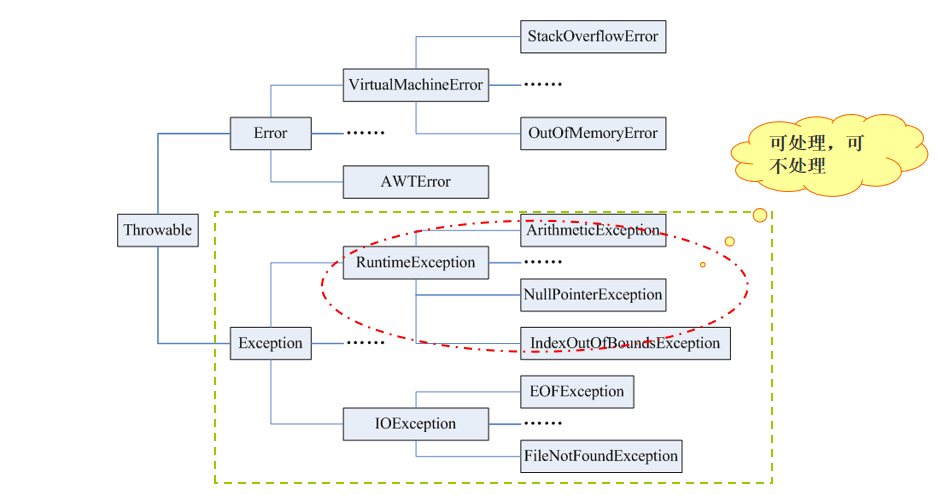
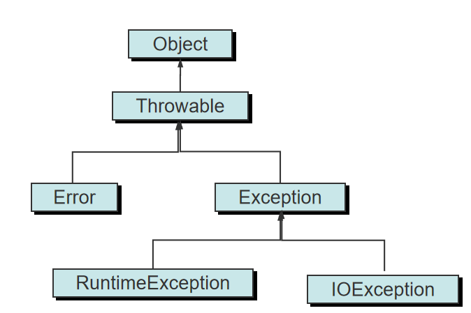
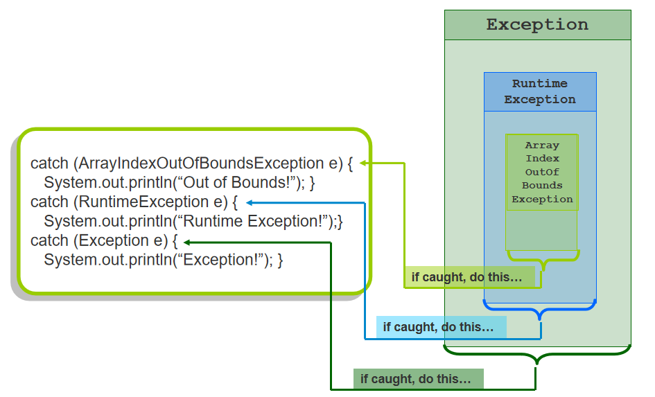
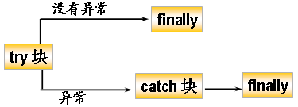

# 111-Java-异常处理机制.md

#### 异常简介

+ 异常的定义
    + 运行期间出现的错误，而不是编译时的语法错误
    + 例如，
        + 打开一个不存在的文件
        + 网络连接中断
        + 操作数组越界等
+ 异常的定义
    + 示 例 **数组越界异常**
```
public class excption_sample {
    public static void main(String args[ ]){
       int i = 0;
       String greetings[ ] = {"Hello World",
                                       "Hello Dingdang",
                                       "Hello Kitty"};

       while(i<4){
          System.out.println(greetings[i]);
          i++;
       }
    }
}
```
#### 异常类的继承关系

+ 异常的继承树



+ 异常类的体系结构



+ Object 类的直接子类Throwable描述了所有被虚拟机抛出的非正常状况。一般情况下很少用Throwable，而是使用它的两个子类Error、Exception。
    + Error类特指应用程序在运行期间发生的严重错误。如：虚拟机内存用尽、堆栈溢出等等。一般情况下这种错误都是灾难性的，所以没有必要使用异常处理机制处理Error。
    + Exception类有几十个子类，描述了不同类型的异常，其中：
        + 以RuntimeException为代表的一些类，称为非检查性异常（unchecked Exception），
        + 以IOException为代表的一些类为检查性异常（checked Exception）。所谓的检查和非检查是指编译器在编译时是否检查。如果代码中存在检查性异常，必须进行异常处理，否则编译时不能通过；而非检查性异常编译时不进行检查，到运行时才会显现。

+ 异常类型  
    + 检查性异常（checked exception）
        + 若系统运行时可能产生该类异常，则必须写出相应的处理代码，否则无法通过编译
        + 非RuntimeException异常

    + 非检查性异常（unchecked exception）
        + 若系统运行时可能产生该类异常，则不必在程序中声明对该类异常的处理，就可以编译执行
        + RuntimeException：运行时异常
+ Java为何分别处理这两类异常？	

一般我们不在 代码中处理非检查性异常，这类异常都在运行时抛出。原因主要是由于程序员经验不足或是思维不缜密造成。如:数组越界异常（ArrayIndexOutOfBoundsException）、整数除以0异常（ArithmeticException）等，这类异常其实就是我们通常说的bug。所以，这类异常应通过反复测试尽量避免，而不应该靠异常处理机制来解决。

检查性异常不同，就算程序员再有经验，也是难以避免。如：用户连接数据库的异常（SQLException），如果是由于数据库服务器没有启动或是网络中断引起的，我们程序员是无法避免的。又如：程序要读取光盘中的文件，而用户忘记插入光盘，此时则抛出文件没找到异常（FileNotFoundException），程序员也无法避免。

综上，异常处理机制主要处理检查性异常而不是非检查性异常和Error。

|非检查性异常|	说明|
| -------- | ------ |
|RuntimeException |	java.lang包中多数异常的基类| 
|ArithmeticException |	算术错误，如除以 0| 
|IllegalArgumentException |	方法收到非法参数| 
|ArrayIndexOutOfBoundsException| 	数组下标出界 |
|NullPointerException |	试图访问 null 对象引用 |


|检查性异常	|说明|
| -------- | ---- |
|ClassNotFoundException|	无法找到想要创建对象的类文件|
|IOException |	I/O 异常的根类| 
|FileNotFoundException |	不能找到文件| 
|EOFException| 	文件结束| 
|IllegalAccessException |	对类的访问被拒绝| 
|NoSuchMethodException| 	请求的方法不存在 |
|InterruptedException |	线程中断| 

#### 异常处理机制

+ 异常的处理过程


+ 在Java程序执行过程中如果出现异常事件，系统会发出异常报告，这时系统将生成一个异常类对象，异常类对象封装了异常事件的信息并将其提交给Java运行时系统
+ Java 中可用于处理异常的两种方式：
    + 自行处理：可能引发异常的语句封入在 try 块内，而处理异常的相应语句则封入在 catch 块内。
    + 回避异常：在方法声明中包含 throws 子句，通知潜在调用者，如果发生了异常，必须由调用者处理。

+ try…catch语句 

**示例  Exception_sample_1.java**

```
public class excption_sample {
    public static void main(String args[ ]){
       int i = 0;
       String greetings[ ] = {"Hello World",
                            "Hello Dingdang",
                            "Hello Kitty"};
      try{  //try{}表示可能发生异常的语句     
          while(i<4){
             System.out.println(greetings[i]);
             i++;
          }
      }catch(ArrayIndexOutOfBoundsException e){//catch( )内的参数异常类对象的声明
             System.out.println(“数组越界异常”);//catch{}内的语句是对异常的处理
        }
      }
 }
```
+ catch块，是用来捕获并处理try块抛出的异常的代码块。没有try块，catch块不能单独存在。我们可以有多个catch块，以捕获不同类型的异常
+ 如果程序抛出多个不同类型的异常，我们需要多个catch()语句来处理。
+ 和特殊异常类相关联的catch()块必须写在和普通异常类相关联的catch()之前。
+ try{…}和catch( ){…}之间不可以添加任何代码



+ 每次try块有异常抛出，系统会试着从上到下往每个catch块中传参，直到遇到一个类型匹配的catch块为止。
+ 如上示例中最后一个catch块中的形参为Exception类型，它是所有异常类的父类，任何异常都可以传参到该块中，该块可以处理任何类型的异常。因此，这个catch块只能放到最后面，否则所有的异常都被它处理了，其他的catch块就不能分门别类的起作用了。
+ 如果编写过程中我们违背了这一点，会产生编译错误：	
```
exception java.io.ArrayOutOfBoundsException has already bean caught
```
+ 一般一个catch块中是专门处理异常的代码，在程序中这里还可以是记录日志的语句，当发生异常时记录该日志，无异常时将不会记录。


#### 异常处理机制——Java7特性

+ catch表达式调整
    + JDK 7中，单个catch块可以处理多个异常类型

```
try {  
   ......  
   
} catch(ClassNotFoundException|SQLException ex) {  
    ex.printStackTrace();  
   
} 
```
+ catch表达式调整
    + 这种用法是不包括异常的子类型的。比如说，下面这个多个异常的捕获语句就会抛出编译错误：
```
try {   
   ......  
  
} catch (FileNotFoundException | IOException ex) {  
   ex.printStackTrace();  
} 
```
+ finally 语句
    + finally语句放在try …catch语句后
    + fianlly语句中的代码块不管异常是否被捕获总是要执行

    + 通常在finally语句中可以进行资源的清除操作，如：关闭打开文件、删除临时文件
    + 对应finally代码中的语句，即使try代码块和catch代码块中使用了return语句退出当前方法或般若break跳出某个循环，相关的finally代码块都有执行。
    + 当try或catch代码块中执行了System.exit(0)时，finally代码块中的内容不被执行

```
catch (ArrayIndexOutOfBoundsException e) {
   System.out.println(“Out of Bounds!”);
   return;
 }
catch (RuntimeException e) {
   System.out.println(“Runtime Exception!”);}
catch (Exception e) {
   System.out.println(“Exception!”); 
   }finally{
       System.out.println("program is running into finally!");//无论是否捕获异常，系统都会执行该语句
   }
```
+ throws关键字
    + 如果一个方法中的语句执行时可能生成某种异常，但是并不能确定如何处理，则可以在程序所在的函数声明后，使用throws关键字抛出异常
```
class ThrowsDemo{
    public  void proc( ) throws IOException{
        System.out.println("inside proc");          
    }
}
```
+ 位置：函数参数列表的后面
+ throws关键字后面，可以跟多个异常，中间用逗号分割 
+ throws关键字抛出的异常，由调用该函数的函数处理。
+ 方法中如果用throws关键字抛出：
    + 非检查性异常：上一级去除异常，直到不抛出异常；
    + 检查性异常
        + 在调用该函数内try-catch，把异常处理掉。那么不往上一级抛出异常，程序正常执行，上一级方法并不知道曾经产生异常。
        + 用throws声明方法抛出异常，不进行处理。谁调用谁负责处理
        + 覆盖方法抛出异常时，可以抛出与被覆盖方法相同的异常或者被覆盖方法异常的子类异常。
```
public class ThrowTest
{
	public void createFile(String path) throws IOException{
		File f= new File(path);
		f.createNewFile();
	}
	public static void main(String[] args){
		ThrowTest  tt = new ThrowTest();
		try{
			tt.createFile("c:/abc.txt");
		}catch(IOException ex){
			ex.printStackTrace();
		}
	}
}
```
+ throw语句         
    + 异常是通过关键字 throw 抛出，程序可以用throw语句引发明确的异常。如：
```
void doA() throws Exception1 {
    try {
        .....
    }catch(Exception1 e){
        throw e;
    }catch(Exception2 e){
        System.out.println("出错了");
    }
}
```
+ throw语句用在方法体内,表示抛出异常,由方法体内的语句处理。不能单独使用，要么和try.. catch…一起使用，要么和throws一起使用。
+ throw语句的操作数一定是Throwable类类型或Throwable子类类型的一个对象
```
public class ThrowTest
{
	public void createFile(String path) throws IOException{
		File f= new File(path);
		try{
			f.createNewFile();
		}catch(IOException ie){
			ie.printStackTrace();
			throw ie;    //再次抛出
		}
	}
	public static void main(String[] args){
		ThrowTest  tt = new ThrowTest();
		try{
			tt.createFile("c:/abc.txt");
		}catch(IOException ex){
			ex.printStackTrace();
		}
	}
}
```
**示例代码：**

```
package 异常的处理;

public class TestExceptionHandler {
	
	public int sum(int a,int b) {
		return a + b;
	}
	
	public static void main(String[] args) throws ClassNotFoundException {//2.消积处理

		//模拟异常，看怎么处理？
		
		//2.消积处理：异常抛出虚拟机，程序终止
		Class.forName("java.a.Date");
		
		//1.积极处理:程序继续执行完毕
//		try {
//			Class.forName("java.a.Date");
//		} catch (Exception e) {
//			e.printStackTrace();
//		}
//		for (int i = 0; i < 100; i++) {
//			System.out.println(i);
//		}

	}

}
```

```
package 异常的处理;

import java.io.File;
import java.io.FileInputStream;
import java.io.FileNotFoundException;
import java.io.IOException;

public class TestExceptionHandler2 {
	
	public static void main(String[] args){

		File file = new File("e:\\HelloWorld.java");
		
		
		FileInputStream is = null;
		try {
			is = new FileInputStream(file);
			int result = is.read();//根据提示选择clause to surrounding by 
			
			
			Class.forName("java.a.b");
//		} catch (ClassNotFoundException | IOException e) {//Java7对catch的改写，可以多个异常同时写
//			e.printStackTrace();
		} catch (FileNotFoundException e) {
			System.out.println("a");
			e.printStackTrace();
		} catch (ClassNotFoundException e1) {

			e1.printStackTrace();
		} catch (IOException e) {
			System.out.println("b");
			e.printStackTrace();
//1.finally语句块有什么 作用？
//	用于释放资源，即使代码抛出异常，
//	finally语句块中的代码也会执行
		}finally {
			try {
				is.close();
			} catch (IOException e) {
				e.printStackTrace();
			}
		}
//2.final finalize finally 有什么区别？
/**
 * final 修饰的类不能有子类 
 *       修饰的方法不能重写 
 *       修饰的变量不能重新赋值，叫常量
 * finalize：如果发现有垃圾对象的话就会调用finalize()方法，释放它所占用的内存 
 * finally: 确保我们程序当中有些释放资源的方法能够执行，
 * 			一般跟在try catch语句块后面     	
 */

	}

}
```

```
package 异常的处理;

import java.io.File;
import java.io.FileInputStream;


public class TestRuntimeException {

	public static void main(String[] args) throws Exception {//消积处理
//		String a = null;
//		System.out.println(a.length());//java.lang.NullPointerException
		
		File file = new File("e:\\HelloWorld.java");
		
		
//		try {
//			FileInputStream is = new FileInputStream(file);
//			
//			int result = is.read();
//		} catch (Exception e) {
//			e.printStackTrace();
//		}//积极处理
		
		FileInputStream is = new FileInputStream(file);
		
		int result = is.read();
	}
}
```
```
package 异常的处理;

public class Test {

	public static void main(String[] args) {
		
//		double p = "";//这是语法错误，称不上异常
		/**
		 * 异常：
		 * 代码运行期间出现的错误
		 * 打开一个不存在的文件
		 * 网络连接中断
		 * 操作数组越界等
		 */
		
		for (int i = 0; i < 10; i++) {
			System.out.println(i);
		}
		
//		int b = 0;
//		if(b != 0) {
//			int a = 10 / b;
//		}
		
		try {
			Class.forName("java.a.b");
			System.out.println("a");
		} catch (Exception e) {
			System.out.println("b");
			e.printStackTrace();
		}finally {
			System.out.println("d");
		}
		
		System.out.println("c");
		
		
		
		for (int i = 0; i < 10; i++) {
			System.out.println("i: " + i);
		}
	}
}
```

**以就就是我关于 *Java-自定义异常类*  知识点的整理与总结的全部内容，[另附源码](https://github.com/javaobjects/demo515)**

==================================================================
#### 分割线
==================================================================

**博主为咯学编程：父母不同意学编程，现已断绝关系;恋人不同意学编程，现已分手;亲戚不同意学编程，现已断绝来往;老板不同意学编程,现已失业三十年。。。。。。如果此博文有帮到你欢迎打赏，金额不限。。。**

